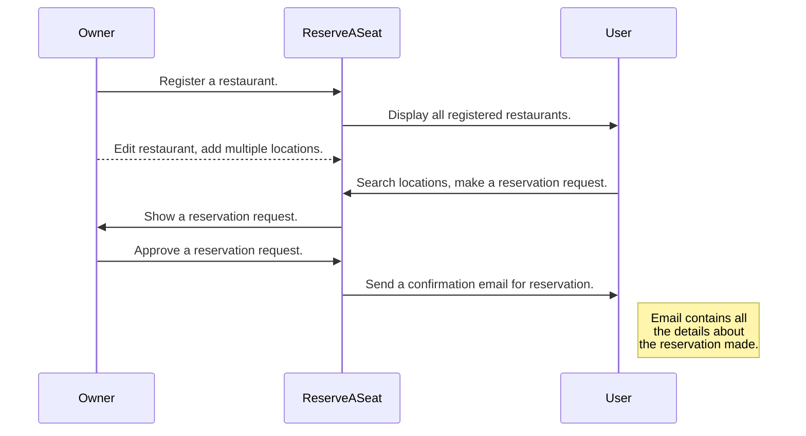

# ReserveASeat

ReserveASeat is a project built as a simple solution to reserving and rating a restaurant/place/diner/pub.

## Functionalities

There are a few main functionalities:
1. Owner mode - Registering a restaurant.
2. Owner mode - Editing details of a restaurant as an owner.
3. User mode - Searching for restaurants on a map.
4. User mode - Sending a reservation request.
5. Owner mode - Approving a reservation request and automatic email sending.

## Diagrams

### Main sequence diagram

